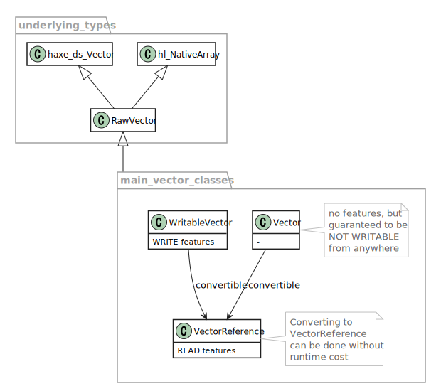

# banker

Data strctures.

**Requires Haxe 4** (tested with v4.0.5).


## Features

This library provides:

- Fixed-length array (or "vector"). Unlike the standard one,  
(1) Strict distinction between Read-only and Writable.  
(2) Uses `hl.NativeArray` on HashLink target.
- Array-based List, Stack, Queue, Deque, Set, Map, ...  
Internally based on the vector type above.  
Also going to add other implementations.
- "Watermark" feature for profiling usage ratio of data collection objects.
- Generate [AoSoA (Array of Structures of Arrays)](https://en.wikipedia.org/wiki/AoS_and_SoA) from any user-defined class. (Experimental)
- Some other small features like `Array` extensions or `ObjectPool` classes.

Internally uses assertion feature of [sneaker](https://github.com/fal-works/sneaker) library, which means:  

- Boundary checks in debug build, and  
- Unsafe, but efficient access in release build


## When to use

Primarily intended for use in game programming.

Suited for following situations:

- Lots of iteration
- Frequent access/changes
- Need to eliminate (or reduce, at least) Garbage Collection pauses
- Reducing overhead is more important than time complexity

## Downsides

- All of this is nothing but reinventing the wheel!
- Don't know much about other libraries/frameworks
- Developed within a few weeks and not yet very well tested


## package: array

Utility functions/extensions for the basic `Array` type.

Might be more efficient than the standard `Lambda`.

## package: vector

Fixed-length array.



## package: container

Collection classes with 1 type parameter.


## package: linker

Collection classes with 2 type parameters.


## package: pool

Provides object pool classes:

- `ObjectPool<T>`
- `SafeObjectPool<T>`

Say you have a class named `Actor`, an example would be:

```haxe
import banker.pool.ObjectPool;

class Main {
	static function main() {
		final factory = () -> new Actor();
		final pool = new ObjectPool<Actor>(10, factory);

		final actorA = pool.get();
		final actorB = pool.get();
		// pool.size == 8

		pool.put(actorA);
		pool.put(actorB);
		// pool.size == 10
	}
}
```

`ObjectPool` can also be extended for your own purpose.

Also `SafeObjectPool` is derived from `ObjectPool`, so that it does  
boundary checks and does not crash even if it is empty/full  
(note that it requires additional memory allocation when trying to get from an empty pool).


## package: watermark

If the compiler flag `banker_watermark_enable` is set, "watermark" feature is activated.

This is a simple profiling feature for all data collection objects (in `container`, `linker` and `pool` packages)
that have limited capacity.

It automatically records the maximum usage (size to capacity ratio) per instance group,  
which enables you to check and adjust the capacity of each data collection object.

Instances are grouped by the name of `Tag` that is attached to each instance.  
About the `Tag`s, see also the [sneaker](https://github.com/fal-works/sneaker) library which underlies this feature.

### How to use

Just set the compiler flag `banker_watermark_enable`, and the profiling runs automatically.

To see the result, call the below whenever you like:

```haxe
banker.watermark.Watermark.printData();
```

## package: aosoa

First create your entity class, and implement `banker.aosoa.Structure`,  
which enables you to use an [AoSoA (Array of Structures of Arrays)](https://en.wikipedia.org/wiki/AoS_and_SoA)  
generated from your original class.

See also:  
[Data-oriented design](https://en.wikipedia.org/wiki/Data-oriented_design)

Caveats:  
The main purpose is improving the performance, however I still don't know much  
about low-level programming and I might be doing everything wrong!

### Example

Define a class (`Actor` here, which has x/y position data).

```haxe
import banker.vector.WritableVector as Vec;

class Actor implements banker.aosoa.Structure {
	/**
		This will append a method `use(initialX, initialY)` to the AoSoA class.
	**/
	@:banker.useEntity
	static function use(
		x: Vec<Float>, y: Vec<Float>, i: Int, initialX: Float, initialY: Float
	): Void {
		x[i] = initialX;
		y[i] = initialY;
	}

	/**
		This will append a method `print()` (without arguments) to the AoSoA.
	**/
	static function print(x: Float, y: Float): Void {
		trace('{ x: $x, y: $y }');
	}

	/**
		This will append `moveHorizontal(dx)`.
	**/
	static function moveHorizontal(
		x: Vec<Float>,
		dx: Float,
		i: Int
	): Void {
		x[i] += dx;
	}

	/** This will be converted to a vector. **/
	var x: Float = 0;

	/** Ditto. **/
	var y: Float = 0;
}
```

Then you can create an AoSoA by `Actor.createAosoa(chunkSize, chunkCount);`.

Now use it as below:

```haxe
class Main {
	static function main() {
		// (2 entities per Chunk) * (3 Chunks) = (max 6 entities)
		final actors = Actor.createAosoa(2, 3);

		trace("Use 4 entities and print them.");
		for (i in 0...4) actors.use(i, i); // set both x and y to i
		actors.synchronize(); // Necessary for reflecting any change
		actors.print();

		trace("Move all and print again.");
		actors.moveHorizontal(10); // x += 10 for each
		actors.synchronize();
		actors.print();
	}
}
```

```
Main.hx:6: Use 4 entities and print them.
Actor.hx:26: { x: 0, y: 0 }
Actor.hx:26: { x: 1, y: 1 }
Actor.hx:26: { x: 2, y: 2 }
Actor.hx:26: { x: 3, y: 3 }
Main.hx:11: Move all and print again.
Actor.hx:26: { x: 10, y: 0 }
Actor.hx:26: { x: 11, y: 1 }
Actor.hx:26: { x: 12, y: 2 }
Actor.hx:26: { x: 13, y: 3 }
```

### Details

An AoSoA consists of multiple Chunks (or SoA: Structure of Arrays).

Each chunk has a fixed capacity and contains vector data that are converted  
from the original `Structure` class, with the same variable names.

Regarding the user-defined functions:

-	Any static function with `@:banker.useEntity` metadata is converted to a method  
which finds a new available entity and sets initial values to it.
- Any other static function is converted to an iterator method,  
which iterates all entities that are currently in use.

Regarding the function arguments:

- Arguments that match any of the variable names are internally  
provided in the AoSoA/Chunk so you don't need to pass them manually.
- Define an argument with the original type (e.g. `x: Float`) to get READ access, or  
with the vector type (`x: banker.vector.WritableVector<Float>`) for WRITE access.
- If you need WRITE access, you also have to include a special argument `i: Int`  
and use it as an index for writing to vectors.
- For disusing (releasing) an entity, define a special argument `disuse: Bool` in  
any iterator function, and write `disuse = true` under any condition you'd like.  
This will release the entity the next time you call `synchronize()` (below).

Other:

- Each AoSoA instance has a method `synchronize()`, which reflects use/disuse/other changes of entities.  
The changes are buffered and are not reflected unless you call this.
- Set the compiler flag `sneaker_macro_log_level` to 500 or more to show debug logs during the class generation.


## Doesn't work?

Classes in `container`/`linker`/`pool` packages use [ripper](https://github.com/fal-works/ripper) library.

If you are using [completion server](https://haxe.org/manual/cr-completion-server.html),
sometimes it might go wrong and raise odd errors due to the reusing of macro context.

In that case you may have to reboot it manually (if VSCode, `>Haxe: Restart Language Server`).


## Compilation flags

|library|flag|description|
|---|---|---|
|banker|banker_watermark_enable|Enables watermark mode (see above).|
|banker|banker_generic_disable|Disables `@:generic` meta.|
|sneaker|sneaker_macro_log_level|Threshold for filtering macro logs. 500 or more to show all, less than 300 to hide all.|
|sneaker|sneaker_macro_message_level|Similar to above. See [sneaker](https://github.com/fal-works/sneaker) for more details.|


## Dependencies

- [sneaker](https://github.com/fal-works/sneaker) for assertion and logging
- [ripper](https://github.com/fal-works/ripper) for partial implementation
